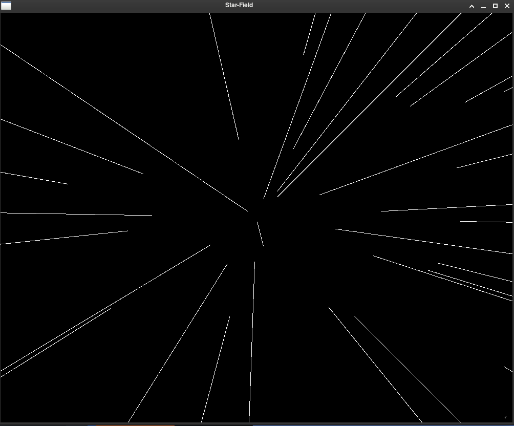

## StarField Animation

A working version of Star-field animation, it could have been better if it were in 3d,may be because of just 2d restriction in plain sfml, but either way it was just made for fun purpose. 

The animation looks like:



Currently just works for linux machine using GNU g++ compiler and also GNU Make.

Download the source code and do:
```
$ cd directory
$ make
$ ./output
```